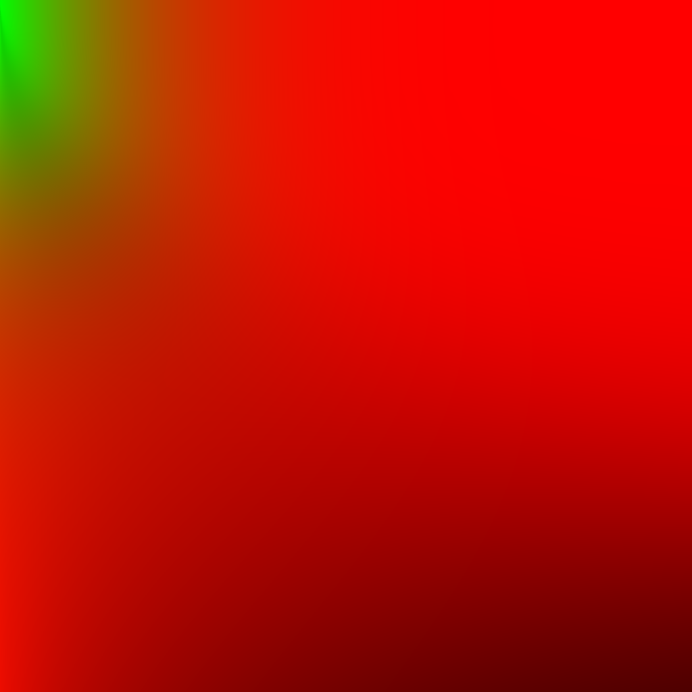
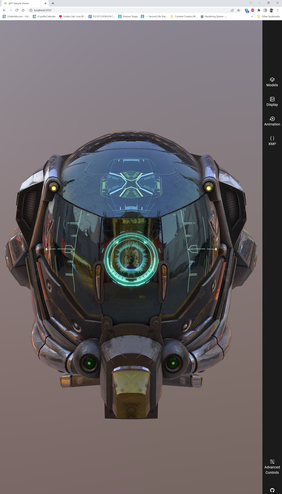
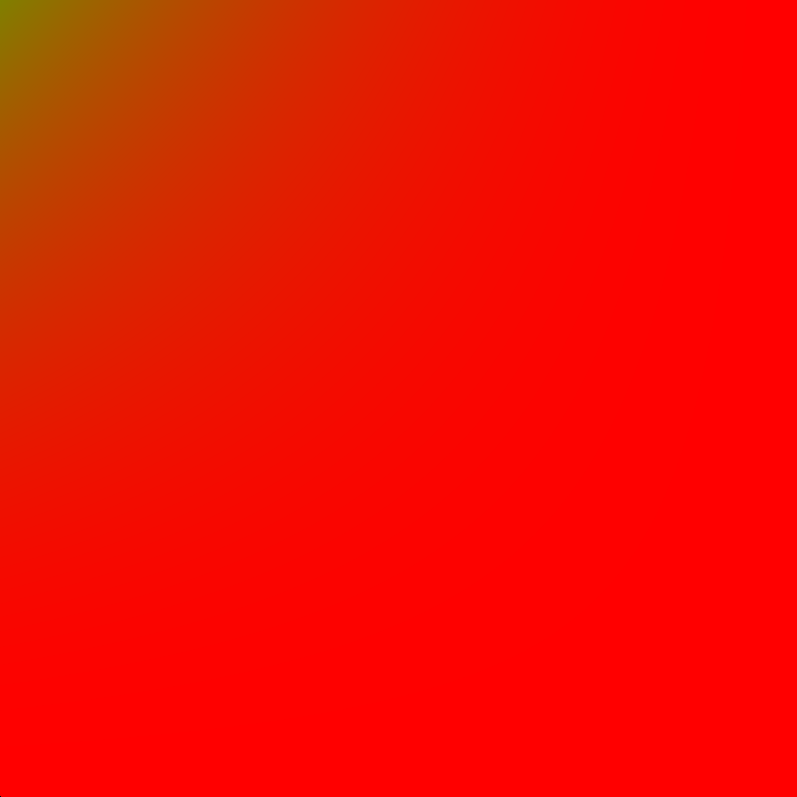
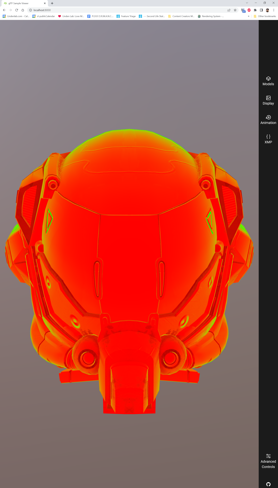
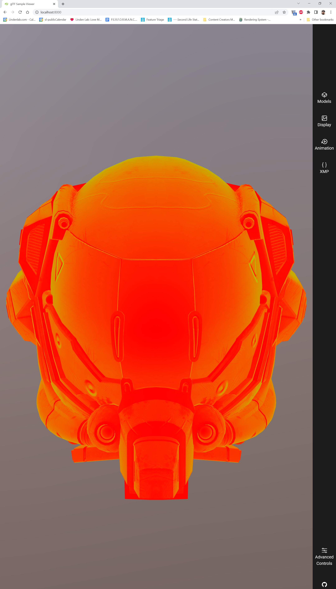
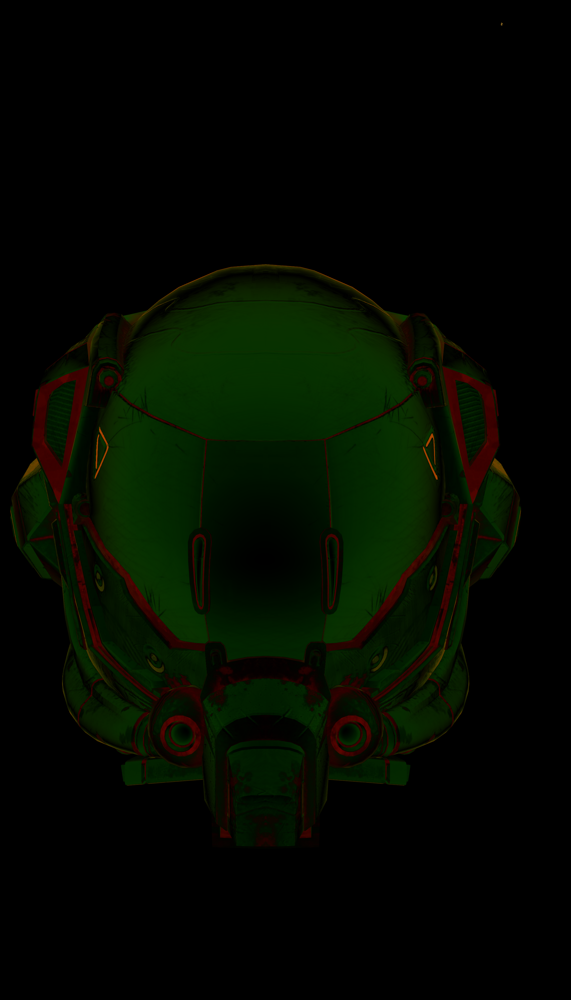

GGX Reference vs Fast Approximation

The GGX LUT table can generated with this shadertoy example:
* 

The [glTF Sample Viewer](https://github.com/KhronosGroup/glTF-Sample-Viewer) uses this GGX LUT [texture](https://github.com/KhronosGroup/glTF-Sample-Viewer/blob/master/assets/images/lut_ggx.png):
* 

PBR refence image using GGX LUT
* 

If you use this [fast GGX approximation](https://github.com/KhronosGroup/glTF-Sample-Viewer/commit/5b408c6fbf56253b12083d7048f444951f1f01af) instead ...
```
vec2 getGGXApprox( vec2 uv ) // brdfSamplePoint
{
    vec2  st    = vec2(1.) - uv;
    float d     = (st.x * st.x * 0.5) * (st.y * st.y);
    float scale = 1.0 - d;
    float bias  = d;
    return vec2( scale, bias );
}
```

... which produces this ...
* 

... the image quality is not bad:

With GGX 
* !PBR Approx](pics/1_pbr_approx.png)

Image Difference
* 

Using my [fork](https://github.com/PtolemyLinden/glTF-Sample-Viewer/tree/cleanup_ggx) in Advanced Controls > Debug Channels we can render the object with the GGX reference texture:
* 

And with the GGX fast approx we have this:
* 

The difference is:
* 


